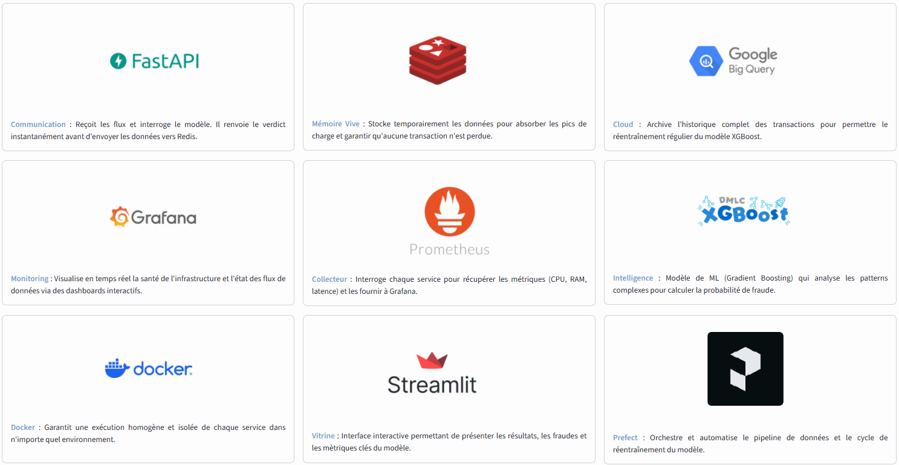

# Détection de fraudes bancaires en temps réel

Ce projet a été réalisé dans le cadre de la formation Data Analyst à la Wild Code School. Il simule un flux de transactions bancaires, les analyse via un modèle de Machine Learning (XGBoost) et monitore les performances en temps réel.

## L'Équipe
* **Frédéric Bayen** - *Architecture MLOps, BigQuery, Streamlit, FastAPI & Automatisation*
* **Kenji Victor** - *Streamlit, Grafana & Prometheus, FastAPI*
* **Jean-Baptiste Leduc** - *Data Visualization, Streamlit Dashboards, Redis & Modélisation XGBoost*

## Vision Business & storytelling

### Le constat : Une hémorragie financière

Imaginez une banque digitale en pleine expansion. Chaque jour, des milliers de clients effectuent des transactions cruciales depuis leur mobile. Cette ouverture numérique est devenue la cible privilégiée des réseaux criminels spécialisés dans le détournement de fonds. Pour notre institution, cette faille de sécurité se chiffrait par des pertes réelles de **plusieurs centaines de millions d'euros par an.**


### La problématique : L'équilibre entre sécurité et fluidité

Le défi posé à notre équipe : stopper la fraude sans dégrader l'expérience utilisateur.

 - **Rapidité** : La décision (bloquer ou autoriser) doit être rendue en quelques millisecondes pour ne pas ralentir le client.

 - **Satisfaction Client** : Un "Faux Positif" (client honnête bloqué par erreur) est commercialement problématique et a un coût financier non négligeable.


### La solution : Un système vivant et auto-adaptatif

Plutôt qu'un modèle statique, nous avons conçu une infrastructure évolutive. Grâce à notre pipeline MLOps, le système apprend en continu. Dès que de nouvelles typologies de fraude apparaissent, le modèle se réentraîne automatiquement pour s'adapter aux nouvelles menaces, garantissant une protection toujours à jour.


### Le pilotage

Pour garder un contrôle total sur la solution, nous avons déployé deux centres de commandement :

 - Pour garder le contrôle, nous avons développé un **panneau de suivi Streamlit**. Il permet de visualiser les flux en temps réel, d'analyser les comportements suspects et de piloter la stratégie de sécurité de la banque. C'est ici que l'intelligence artificielle rencontre l'humaine.

 - **La supervision infrastructure (Grafana & Prometheus)** : Cette interface surveille la santé technique du système. Nous suivons en temps réel la consommation CPU/RAM de chaque conteneur et la latence de l'API pour garantir une haute disponibilité et des performances constantes sous la charge.


### Nos résultats sur la fraude

1. **Le Bouclier (Recall de 87 %)** : Nous interceptons désormais la grande majorité des tentatives de fraude.

2. **La fluidité client (Spécificité de 99,4 %)** : Nous garantissons une expérience sans problème. 99,4 % des transactions légitimes sont validées instantanément, minimisant ainsi le mécontentement client.

3. **L'efficacité des alertes (Précision de 63 %)** : Sur l'ensemble des transactions bloquées pour suspicion, près de 2 sur 3 sont réellement des fraudes. Ce score élevé permet aux équipes de sécurité de se concentrer sur des menaces hautement probables plutôt que de traiter un volume ingérable de fausses alertes.


### Note sur la simulation de la "Vérité Terrain"

Dans ce projet, les transactions envoyées vers BigQuery incluent la valeur réelle de fraude.

Pourquoi ce choix ? Dans un environnement bancaire réel, il existe un décalage temporel : le modèle prédit une fraude à l'instant T, et la confirmation réelle (le "retour client" ou le signalement) arrive plus tard.

Pour les besoins de la démonstration en temps réel et pour permettre au cycle d'auto-apprentissage (MLOps) de fonctionner de manière fluide, nous avons "compressé le temps". Nous simulons ce retour d'information instantanément afin de démontrer la capacité du pipeline à :

 - Détecter l'apparition de nouveaux patterns.

 - Déclencher un réentraînement automatique basé sur des données vérifiées.

- Comparer immédiatement la prédiction du modèle avec la réalité pour calculer les métriques de performance.


---


## Architecture du Pipeline

L'application repose sur une architecture micro-services conteneurisée avec Docker.




```text
[ SOURCE : PaySim_stream.csv ]
      |
      | Lecture (streamenvoi.py)
      v
[ CERVEAU : API + Modèle ] <---------------------------+
+-----------------------+       +-------------------+  |
|  streamrecepteur.py   | ----> |  ML_XGBoost.ipynb |  | 
|  (FastAPI + modèle)   | <---- |  Modèle XGBoost   |  |    
+-----------------------+       +-------------------+  |
      |                                                |
      | Résultats (LPUSH)                              |
      v                                                |
[ STOCKAGE : Redis ]                                   |
+------------------------------------------+           |
|              REDIS (Cache)               |           |
|  - flux_global (Archive BigQuery)        |           |
|  - flux_streamlit (Affichage direct)     |           |
+------------------------------------------+           |
      |                     |                          |
      |                     | Archivage                |
      |                     v                          |
      |                +-------------------+    [ MLOPS : Prefect ]
      |                |   worker_bq.py    |    +-----------------+
      |                | (Envoi BigQuery)  |--->|  retrain.py     |
      |  Monitoring    +-------------------+    |  (Auto-Train)   |
      v                                         +-----------------+
      +----------------------------------------------------------+
      |                                                          |     
      v                                                          v
[ SUPERVISION : Prometheus & Grafana ]             [ TABLEAU DE BORD : Streamlit]
+------------------------------------------+    +------------------------------------------+
| - Metrics système (CPU/RAM conteneurs)   |    | dashboard.py                             |
| - Metrics business (Taux de fraude)      |    | - Dashboarding & Alerting Temps Réel     |
| - Metrics FASTAPI                        |    | - EDA                                    |
+------------------------------------------+    +------------------------------------------+
```

---

## Gestion des données

Le projet utilise le dataset PaySim [(disponible ici sur Kaggle)](https://www.kaggle.com/datasets/mtalaltariq/paysim-data).

Pour simuler un environnement de production réel, nous avons créé un script ```decoupe.py``` pour segmenter les données :

 - **90% (Historique)** : Utilisés pour l'entraînement initial et stockés comme base de référence.

 - **10% (Flux Stream)** : Isolés pour simuler l'envoi de transactions ligne par ligne par streamenvoi.py.

Cette méthode garantit que le modèle est testé sur des données qu'il n'a jamais rencontrées lors de sa phase d'apprentissage initiale.

---

## Lancement rapide

### Prérequis

   - **Docker** & Docker Compose installés.

   - **BigQuery** : Créer un projet sur la Console Google Cloud.


### Installation

1. **Cloner le projet.**

2. **Télécharger le dataset PaySim [(disponible ici sur Kaggle)](https://www.kaggle.com/datasets/mtalaltariq/paysim-data).** et le placer dans ```./data/```


3. **Copier le template des variables d'environnement**

      ```cp .env-dist .env```

      -> Remplir le .env avec vos variables d'environnement

4. **Initialisation du projet (uv)**

      ```uv sync```

5. **Découpe du dataset**

      ```uv run src/notebooks/decoupe.py```
   
      -> Dataset ```PaySim_stream.csv``` et ```PaySim_historical.csv``` créés dans le dossier ./data/

6. **Générer la clé Json Bigquery**

      - Activer l'API BigQuery, et créer un compte de service avec les rôles BigQuery Admin et Storage Admin.

      - Générer une clé JSON, la nommer ```gcp-key.json``` et la placer à la racine du projet.

7. **Ingestion des données historiques dans BigQuery**

      ```uv run ingestion/ingestion.py```

8. **Lancer l'infrastructure :**

      ```docker compose up --build```

---

### Accès aux services

 - **Dashboard Streamlit** : http://localhost:8501

 - **Documentation API** : http://localhost:8000/docs / http://localhost:8000/report / http://localhost:8000/reload

 - **Monitoring Grafana** : http://localhost:3000

 - **Prometheus** : http://localhost:9090

 - **Processus de réentrainement** : ```docker logs -f retrain-automation```

 - **Processus d'envoi vers BigQuery/** : ```docker logs -f worker-bigquery```

 - **Redis** : lister les listes : ```KEYS *``` / afficher l'intégralité d'une liste : ```LRANGE liste_fraudes 0 -1```

---

## Performance du modèle (XGBoost)

Compte tenu du fort déséquilibre des données (99,87% de transactions saines vs 0,13 % de fraudes), l'Accuracy (précision globale) n'est pas un indicateur pertinent. Nous nous concentrons sur la capacité du modèle à détecter les fraudes réelles.

**Résultats sur le Test Set de la v1**

Métrique|Valeur|Interprétation
| :--- | :--- | :--- |
| **Recall** | 87 % | Le modèle identifie avec succès 87 % des tentatives de fraude. | 
|**Précision** | 63 % | Lorsqu'on prédit une fraude, elle est réelle dans 63 % des cas. | 
|**F1-Score** | 0.73 | Un excellent équilibre pour un système de détection en temps réel. | 

---

## Automatisation MLOps

Le conteneur retrain-automation surveille la table BigQuery via Prefect.

 - Modularité : Le seuil de déclenchement (```min_rows_to_retrain```), le nombre de transactions récupérées sur BigQuery  (```limit_sql```) et l'intervalle de vérification (```check_interval_secondes```) sont modifiables sans redémarrage dans ```state.json```.

 - Action : Dès que le seuil est atteint, le modèle est réentraîné sur les nouvelles données, archivé, et l'API est notifiée pour charger la nouvelle version instantanément.

---

## Structure du dossier

```
├── data/                  # Datasets (CSV historiques et flux stream)
├── grafana/               # Configuration du monitoring
│   ├── dashboards/        # Fichiers JSON des dashboards (RAM, Principal, etc.)
│   └── provisioning/      # Configuration automatique des sources de données
├── notebooks/             # Travail exploratoire et recherche
│   ├── decoupe.py         # Script de split du dataset (90/10)
│   ├── EDA_PaySim.ipynb   # Analyse exploratoire des données
│   └── ML_XGBoost.ipynb   # Entraînement et tests du modèle
├── src/                   # Code source applicatif
│   ├── API/               # streamrecepteur (FastAPI), streamenvoi et worker_bq
│   ├── dashboard/         # Interface utilisateur Streamlit (dashboard.py)
│   ├── ingestion/         # Scripts de traitement des données
│   ├── models/            # Fichiers .joblib (pipeline_latest, archives)
│   └── retrain/           # Automatisation MLOps (retrain.py)
├── docker-compose.yml     # Orchestration des services Docker
├── Dockerfile             # Configuration de l'image Python/UV
├── prometheus.yml         # Configuration de la collecte des métriques
├── state.json             # État dynamique et configuration du réentraînement
└── README.md              # Documentation du projet
```

---

## Maintenance et réinitialisation

Pour remettre le projet à zéro, tapez uniquement cette CLI  : ```python reset_projet.py```

 - **Modèles** : Suppression de pipeline_latest.joblib et vidage des archives.

 - **État** : Réinitialisation du compteur last_count dans state.json.

 - **Infrastructure** : Purge totale de Redis (via Docker) et des tables BigQuery.

---

## Problèmes rencontrés & solutions apportées


| Défi Technique | Impact | Solution apportée |
| :--- | :--- | :--- |
| **Déséquilibre des classes** | Dataset à 0.13% de fraudes, biaisant fortement les prédictions initiales. | Utilisation de `scale_pos_weight` calculé dynamiquement sur le ratio réel Fraude/Normal lors du réentraînement. |
| **Performance de l'entraînement** | RandomForest trop lent pour l'optimisation par GridSearch (estimé à plusieurs mois). | Passage à **XGBoost (CUDA/GPU)** et utilisation de **RandomizedSearch** pour une optimisation rapide. |
| **Optimisation du réentraînement** | Temps de calcul excessif et risques d'incompatibilité matérielle **(CUDA/GPU)** selon l'hôte.| Mise en place d'un **échantillonnage intelligent** : filtrage des données BigQuery pour entraîner sur un volume optimal, garantissant un cycle MLOps rapide et compatible CPU|
| **Affichage Temps Réel** | Interface Streamlit statique par défaut, ne reflétant pas le flux entrant. | Boucle `while True` avec placeholders `st.empty()` pour rafraîchir les KPIs sans rechargement de page. |
| **Reset de Redis** | La consommation des données par le worker BigQuery vidait le cache Redis, rendant les données indisponibles pour le dashboard. | Mise en place d'un **double flux** : un flux persistant pour l'UI Streamlit et un autre pour l'archivage BigQuery. |
| **Choix de l'Orchestrateur** | Airflow s'est révélé trop complexe et gourmand en ressources pour ce projet. | Pivot vers **Prefect**, plus léger, moderne et parfaitement adapté à notre architecture événementielle. |
| **Apprentissage Docker** | Complexité des réseaux inter-conteneurs et des dépendances pour des novices. | Gestion des ordres de démarrage (`depends_on`) et isolation des réseaux internes (`networks`). |
| **Synchronisation du Pipeline** | Risque de charger un modèle incomplet pendant l'écriture disque. | Système de **notification Push** : l'API recharge le modèle via `/reload` uniquement après confirmation de sauvegarde complète. |
| **Data Leakage** | Score de performance artificiellement élevé (99.9%) via les variables `newbalance`. | **Suppression préventive** des variables "du futur" (`newbalanceOrig/Dest`). |


